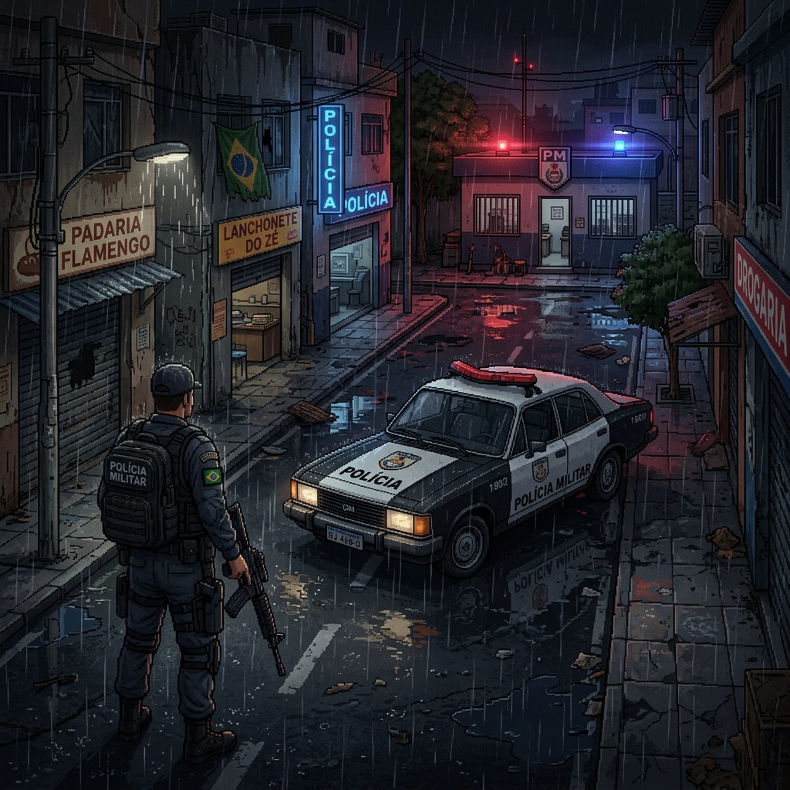
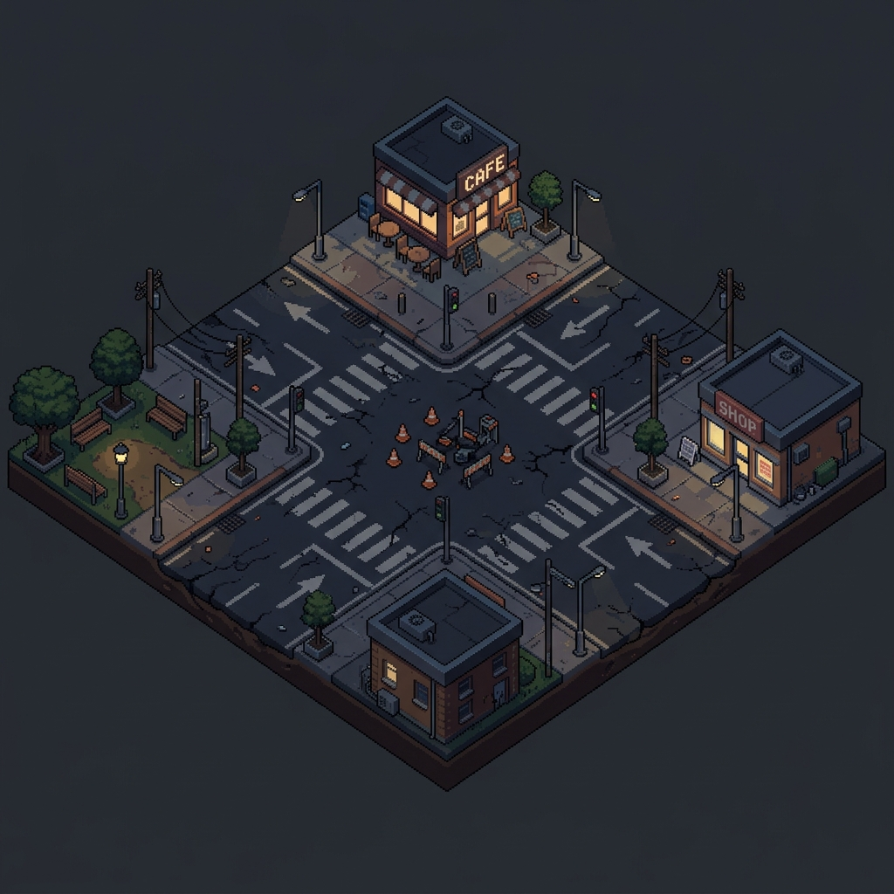
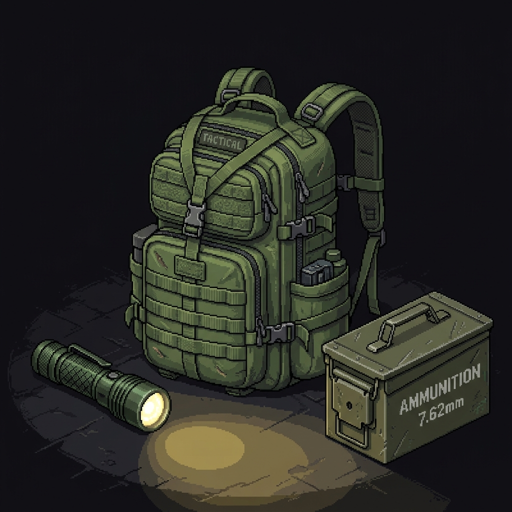
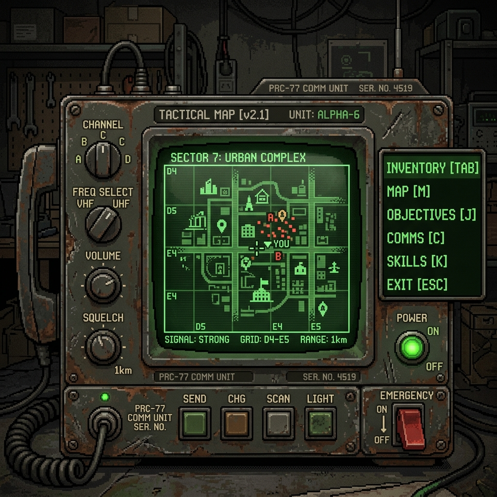
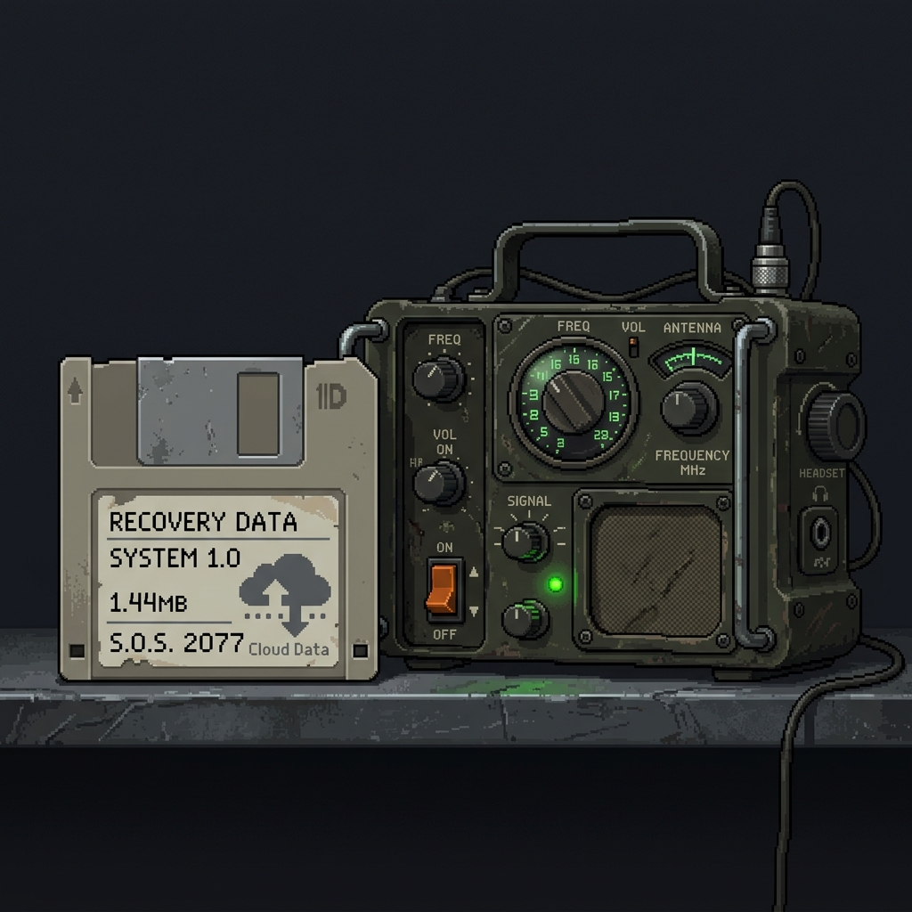

  

# Unfallen — Resistência no Colapso

**Unfallen** é um jogo web isométrico 2.5D de ação, aventura e sobrevivência narrativa. Desenvolvido com foco na história de Antônio Rafael, o capítulo atual, **"Plantão Final"**, retrata a resistência em um hospital durante o colapso de uma pandemia infecciosa.

> **Status:** 🚧 MVP Técnico em Desenvolvimento (BLOCO 06 concluído).

---

## 📸 Screenshots e Concept Arts

  
  

 

  
  

---

## 🛠 Stack Técnica

O projeto utiliza uma arquitetura moderna para web moderna e engine HTML5:

- **Next.js (App Router)** - SSR/SSG, rotas da API e interface UI/UX
- **Phaser 3** - Engine HTML5 para renderização isométrica e loop de gameplay
- **Firebase Authentication** - Autenticação segura de usuários
- **MongoDB Atlas** - Armazenamento de dados do jogo e Cloud Saves
- **Vercel** - Hospedagem da aplicação (Planejado)
- **SDD Master** - Ferramenta proprietária de governança técnica e controle de qualidade

---

## ⚙️ Funcionalidades Já Implementadas (MVP Técnico)

- ✅ Landing page visual
- ✅ Login / Autenticação com Firebase
- ✅ Base de Save/Load robusta com MongoDB
- ✅ Inicialização e blindagem do Phaser Runtime em ambiente React/Next.js
- ✅ Motor isométrico 2.5D (cálculos de colisão, conversão e depth-sorting)
- ✅ Player placeholder controlável
- ✅ HUD técnico implementado
- ✅ Sistemas de status: Estamina e Bateria/Lanterna
- ✅ Sistema de Inventário (12 slots lógicos)
- ✅ Interação e coleta de itens básicos
- ✅ Inimigo placeholder (Lógica de detecção e colisão)
- ✅ Combate básico por raio/distância
- ✅ Sistema de Respawn / Game Over técnico
- ✅ Testes automatizados (100+ testes unitários e de integração aprovados)

---

## 🗺 Roadmap de Desenvolvimento

- [ ] **BLOCO 07** — Fase narrativa “Plantão Final” e diálogos baseados na lore.
- [ ] Implementação de **Assets finais** de arte (pixel-art).
- [ ] Áudio e sistema de rádio narrativo dinâmico.
- [ ] Cheats e ferramentas de debug em tempo real.
- [ ] QA e Playtesting.
- [ ] Deploy em produção (Vercel + MongoDB).
- [ ] Publicação pública do jogo.

---

## ⚖️ Política de Assets e Direitos Autorais

Para garantir a viabilidade comercial e jurídica do projeto Unfallen:

- **Ativos Originais:** A Inteligência Artificial (incluindo modelos de difusão) só pode ser utilizada para a geração de assets 100% originais que não infrinjam direitos autorais existentes.
- **Assets Pagos:** O uso de assets de terceiros (incluindo pacotes premium de criadores como *Brullov*, *Nano Banana*, etc.) é **estritamente proibido sem a verificação e obtenção formal da respectiva licença comercial**.
- **Proibição de Extração:** É terminantemente proibido copiar, printar, recortar ou reconstruir assets de demonstração, pagos ou com direitos autorais.
- Todos os assets do projeto devem obrigatoriamente estar catalogados no registro `docs/03-codigo/assets-registry.md`.

---

## 🔒 Segurança e Variáveis de Ambiente

Práticas de segurança estritas aplicadas na raiz do repositório:

- **Arquivos Ignorados (`.gitignore`):** Nunca versionar `.env`, `.env.local`, `.sdd-master/` ou `node_modules/`.
- **Prevenção contra Vazamentos:** Nenhuma credencial real, chave privada ou senha é versionada.
- **`.env.example`:** Contém apenas placeholders perfeitamente seguros (e.g., `replace_with_firebase_private_key_escaped_newlines`), desprovidos de quaisquer dados que simulem assinaturas de chaves privadas reais para prevenir falsos-positivos em varreduras de segurança.
- **Controle SDD:** O projeto passa regularmente por varreduras com a ferramenta `sdd master git`.
