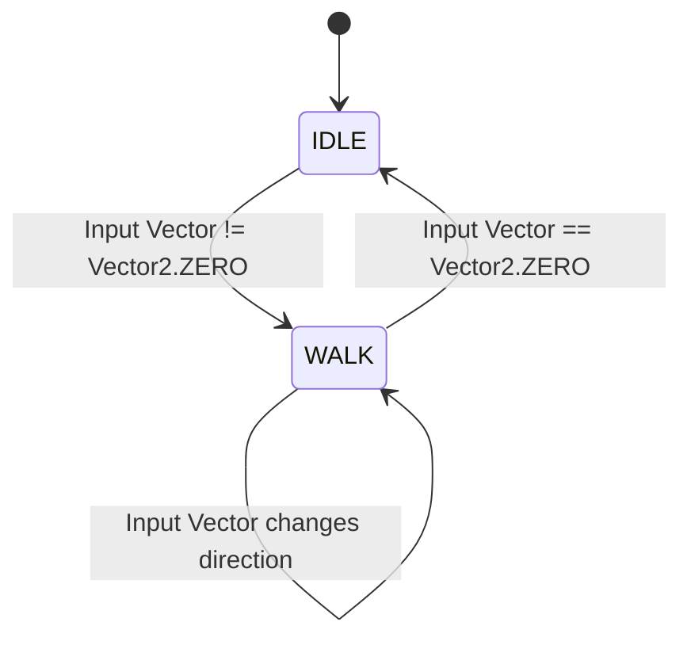

# Data Model & State Machine: Protagonist Base Setup

This document outlines the state representation and entities for the protagonist setup in Unfallen.

## Key Entities

### 1. Player (Antônio Rafael)
Represents the main playable character.
* **Properties**:
  * `speed` (float): The default walking speed in pixels per second. Default value: `120.0`.
  * `direction` (Vector2): The normalized isometric vector representing current movement direction.
  * `facing_direction` (Enum): The direction the player is looking towards.
  * `current_state` (Enum): Current movement state.

* **Enums**:
  * **MovementState**: `IDLE`, `WALK`
  * **FacingDirection**:
    * `SOUTH_WEST` (Sudoeste: default start direction, facing lower-left)
    * `SOUTH_EAST` (Sudeste: facing lower-right)
    * `NORTH_WEST` (Noroeste: facing upper-left)
    * `NORTH_EAST` (Nordeste: facing upper-right)

### 2. StaticObstacle
Represents collision barriers in the test level.
* **Properties**:
  * `collision_shape` (CollisionShape2D): Rectangle or polygon defining the physical bounds of the solid block.

---

## State Machine & Transitions

The protagonist movement uses a simple finite state machine (FSM) to switch between animations and physics calculations:

### Transition Rules

1. **Idle to Walk**:
   - **Trigger**: User presses W, A, S, D or arrow keys.
   - **Action**: Calculate input direction, normalise diagonal inputs, set physics velocity, change animation to `walk_[direction]`.

2. **Walk to Idle**:
   - **Trigger**: User releases all movement keys.
   - **Action**: Set velocity to `Vector2.ZERO`, preserve `facing_direction`, change animation to `idle_[direction]`.

3. **Direction Selection**:
   - The system maps the 2D movement vector to the nearest isometric direction (SOUTH_WEST, SOUTH_EAST, NORTH_WEST, NORTH_EAST) based on angle zones:
     - Vector pointing Down-Left (-x, +y orthogonal) -> `SOUTH_WEST`
     - Vector pointing Down-Right (+x, +y orthogonal) -> `SOUTH_EAST`
     - Vector pointing Up-Left (-x, -y orthogonal) -> `NORTH_WEST`
     - Vector pointing Up-Right (+x, -y orthogonal) -> `NORTH_EAST`
